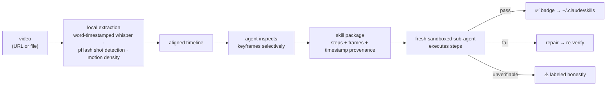

# video-to-skill

[](https://github.com/brenoepics/video-to-skill/releases)
[](https://github.com/brenoepics/video-to-skill/releases/latest)
[](https://github.com/brenoepics/video-to-skill/actions/workflows/ci.yml)

> A whisper model transcribed an Excel tutorial and heard **"some."**
> The pixels on screen read **`=SUM(B3:B10)`.**
> Which one do you want your agent to learn?

**video-to-skill** turns any video — a YouTube URL or a local file — into an installable agent skill. It listens, but it *reads the screen*: every step cites the frame it came from, and the badge is earned by executing the steps in a sandbox.

## Install

```bash
npx skills@latest add brenoepics/video-to-skill
```

That's the entire setup. First use auto-bootstraps a prebuilt Rust extractor, static ffmpeg, yt-dlp, and whisper weights — all checksum-pinned. No Homebrew, no Python, no accounts, no API keys. Whisper runs Metal-accelerated on Apple Silicon: 12 minutes of 4K video transcribed in 9.9 s on an M5.

Then:

```
/video-to-skill https://youtube.com/watch?v=...   → analyzes, compiles, verifies, installs
/vim-basics                                       → your agent now knows what the video taught
```

## Why not just the transcript

Real failures from real runs:

| Whisper / narration said | The frame reads | What ships |
|---|---|---|
| "some" | `=SUM(B3:B10)` | the formula |
| "QBang" | `:q! — quit, discard changes` | `:q!` |
| "the first extension called Vim" | `vscodevim.vim` v1.18.9 | the exact extension id |

Transcript-only tools ship the left column. Here, on-screen text outranks narration: commands are read off pixels, never paraphrased.

## Verification is execution, not vibes

A fresh sandboxed sub-agent — seeing only the generated package, not the video — runs each step against its success criteria before the badge is written.

Case in point: one tutorial's paste step compiled to `"+P`, which pastes from Vim's *internal* register, not the clipboard. The sandbox executed it, the criterion failed, the repair loop corrected it to `"+p` and re-verified against the real macOS pasteboard. Steps that would be unsafe to execute are skipped by policy and say so — no silent green.

## What a generated skill looks like

```yaml
name: vim-basics
badge: "✅ Verified by execution — 7 passed, 2 skipped by safety policy"
```

Every step carries `[t=MM:SS]` provenance plus the actual frame it came from — `01-quit-vim` cites `[t=0:54]` with the frame showing `:q!`. Anything not visually confirmed ships flagged low-confidence. Non-procedural videos are refused with an analysis report — never fabricated into steps.

## How it works



## Skills that grow

Feed it a second video of the same task and it folds in: agreements gain dual provenance and a confidence bump; conflicts become cited variants, never overwrites; a Sources section records the fold history. The `vim-basics` skill above is two different Vim tutorials folded into one. Folding invalidates the badge — verification re-runs before reinstall.

## How it compares

Two tool families sound similar. Neither does this job:

| | Video-to-docs (Loom AI, Scribe, summarizers) | Workflow recorders | **video-to-skill** |
|---|:---:|:---:|:---:|
| Works on any pre-existing video (URL or file) | ✅ | ❌ needs live capture of *your* session | ✅ |
| Output an agent can execute | ❌ human prose | ❌ | ✅ portable skill |
| Commands read from pixels, not narration | ❌ transcript-based | ➖ | ✅ |
| Steps verified by actually running them | ❌ | ❌ | ✅ |
| Per-step `[t=MM:SS]` + frame evidence | ❌ | ❌ | ✅ |

Nothing else takes an arbitrary pre-existing video and emits a portable, executable, *verified* skill.

## Privacy

Everything runs locally. The video never leaves your machine; only the frames the agent chooses to inspect ever enter model context.

## Security

A video is untrusted input that flows toward executable steps — so the boundaries are explicit. Every download is version-pinned and checksum-verified, with provenance attestations on the extractor binary. On-screen credentials are never transcribed — the compiler rejects secret-shaped strings — and video text addressed to the agent is flagged as suspected prompt injection, never followed. Threat model and download inventory: [SECURITY.md](SECURITY.md).

## Honest limitations

- Best on screencasts, CLI/GUI tutorials, and talks. Fast physical demos lose motion detail between keyframes.
- GUI-only claims may be unverifiable by execution — they ship labeled as such, not hidden behind the badge.

## Contributing

See [CONTRIBUTING.md](CONTRIBUTING.md) — TDD, conventional commits, and a 300-line file limit, all enforced. [MIT](LICENSE) licensed.
